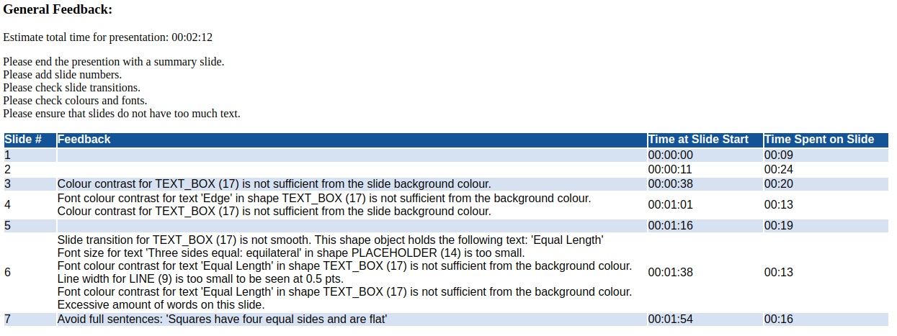

# PPTChecker - Powerpoint Checker

PPTChecker is a tool to check the format of your PowerPoint presentations
so that they can be optimized to better engage with your audience!
All you need is a file in `.pptx` format, generated from either Microsoft PowerPoint or Google Slides.

PPTChecker checks if:

* there are slide numbers
* fonts are large enough
* lines are thick enough
* colours of shapes are visible relative to background
* colours of fonts are visible relative to background
* slide transitions (i.e., positioning of shapes and text between slides) are smooth
* there is not too much text on slides
* there are no complete sentences
* there is a summary slide

If precise speaker notes are provided, PPTChecker can also estimate the approximate time for the overall presentation.
It will also break down the estimated time per slide, giving you an opportunity to optimize slides where you see fit.

PPTChecker generates a table in an HTML webpage, providing both general feedback and slide-by-slide comments.
PPTChecker has been tested on both Microsoft Powerpoint (MS Office 2021) and Google Slides (v84, Nov 2023).


## Installation

1. Install all dependencies listed in `requirements.txt` by running this command:

```
pip install -r requirements.txt
```

2. Open a Python terminal, and download wordnet from [nltk](https://www.nltk.org/data.html).
```
python
>>> import nltk
>>> nltk.download('wordnet')
```

## Instructions to Run

To use PPTChecker, just navigate to the root path of this directory, and run the following command.

```
python pptchecker.py -p <path/to/pptx/file>
```

To run it on an example program,

```
python pptchecker.py -p test/demo.pptx
```



